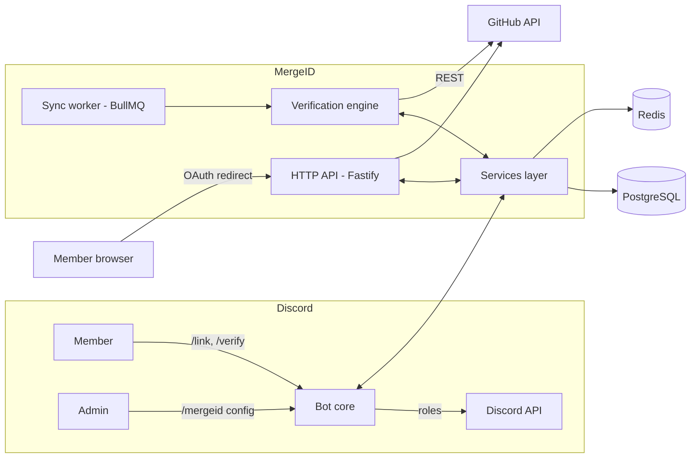

# MergeID

> Securely link and verify GitHub accounts inside Discord — with automatic role sync.

[](https://github.com/Ishannaik/mergeid/actions/workflows/ci.yml)
[](./LICENSE)
[](https://github.com/Ishannaik/mergeid/pulls)
[](https://github.com/Ishannaik/mergeid/issues)

**✅ Status: v1.0.** Foundations (M1), account linking (M2), the verification
engine (M3), admin configuration (M4), periodic sync (M5), and hardening (M6 —
security audit, OAuth e2e tests, self-hosting guide) are implemented.
See the [roadmap](https://github.com/Ishannaik/mergeid/milestones). Grab the image at
`ghcr.io/ishannaik/mergeid:1.0.0` or follow the [self-hosting guide](docs/self-hosting.md).

---

## What is MergeID?

MergeID is an open-source, privacy-first Discord bot that connects your Discord community to
your GitHub organization:

- Members **link their GitHub account** through standard GitHub OAuth — no passwords shared, ever.
- Server admins define **verification rules**: _"members of GitHub org `acme` get the `@Contributor`
  role"_, _"collaborators on `acme/api` with push access get `@Maintainer`"_, _"members of the
  `acme/core` team get `@Core Team`"_.
- MergeID verifies membership against the GitHub API, **assigns roles automatically**, and
  **keeps re-checking** on a schedule — removing roles when access is lost.

### Why MergeID?

- **Verification, not just linking** — many bots store a username; MergeID proves membership and
  re-proves it periodically, so roles never outlive access.
- **General-purpose, not single-community** — the existing open-source options hardcode one repo,
  one role name, and env-var config (e.g. paperclip-discord-bot, discord-github-melder-bot), or
  only cover GitHub Sponsors/starring Linked Roles. MergeID supports per-server org, repo, and
  team rules configured entirely from Discord.
- **Multi-server and multi-rule** — one bot instance serves many Discord servers, each with its
  own isolated rules and configuration.
- **Privacy-first by design** — minimal GitHub scopes, encrypted token storage, user-initiated
  linking only, full data deletion on unlink. No privileged Discord intents required.
- **Self-hostable** — MIT licensed, Docker-ready, with PostgreSQL and Redis as the only external
  dependencies.

### Features

- Discord ↔ GitHub account linking via GitHub OAuth
- Organization membership verification
- Repository collaborator verification (public and private repos)
- GitHub team membership verification
- Automatic Discord role assignment and removal
- Periodic re-verification, configurable per rule
- Slash-command UX: `/link`, `/unlink`, `/status`, `/verify`
- Per-server admin configuration with audit logging
- Secure token handling (AES-256-GCM at rest) and GitHub token revocation on unlink

## Architecture at 10,000 feet



One codebase, three runtime roles (`bot`, `api`, `worker`) that run in a single process for small
deployments and split into separate horizontally-scalable services when needed. Full design:
[`docs/architecture.md`](docs/architecture.md).

## Tech stack

| Concern      | Choice                      | Why (short)                                            |
| ------------ | --------------------------- | ------------------------------------------------------ |
| Language     | TypeScript on Node.js ≥ 22  | First-class discord.js support, async-first, typed     |
| Discord      | discord.js v14              | Mature slash-command support, sharding built in        |
| HTTP         | Fastify                     | Minimal, fast, schema-validated routes                 |
| Data         | Prisma + PostgreSQL         | Typed access, migrations, multi-instance friendly      |
| Jobs & state | BullMQ + Redis              | Durable periodic sync, TTL OAuth state, rate budgeting |
| GitHub       | Octokit                     | Official SDK, pagination + rate-limit aware            |
| Validation   | zod                         | Env, config, and payload validation                    |
| Logging      | pino                        | Structured logs with secret redaction                  |
| Tests        | Vitest                      | Fast, TypeScript-native                                |
| Quality      | ESLint (flat) + Prettier    | Consistent style, enforced in CI                       |
| CI/CD        | GitHub Actions + changesets | PR gates, automated versioning, GHCR Docker images     |

Details and alternatives considered: [`docs/tech-stack.md`](docs/tech-stack.md).

## Repository layout

```
mergeid/
├── docs/                  # Architecture, security model, roadmap, guides
├── src/                   # Application source
│   ├── discord/           # Gateway client, slash commands, events
│   ├── api/               # Fastify HTTP server (OAuth callback, health)
│   ├── github/            # Octokit client, OAuth exchange, membership checks
│   ├── verification/      # Rule engine: GitHub facts → role decisions
│   ├── sync/              # BullMQ worker for periodic re-verification
│   ├── services/          # Domain services (links, guild config, audit)
│   ├── crypto/            # Token encryption (AES-256-GCM)
│   ├── config/            # Env loading + zod validation
│   └── lib/               # Logger, errors, rate limiting
├── prisma/                # Schema + migrations
├── test/                  # Vitest suites
├── docker/                # Dockerfile + compose files
└── .github/               # CI workflows, issue/PR templates, Dependabot
```

## Documentation

| Document                                           | Contents                                                          |
| -------------------------------------------------- | ----------------------------------------------------------------- |
| [`docs/architecture.md`](docs/architecture.md)     | Components, folder structure, module responsibilities, data flows |
| [`docs/tech-stack.md`](docs/tech-stack.md)         | Every stack choice with justification and alternatives considered |
| [`docs/database.md`](docs/database.md)             | ERD, table definitions, indexes, retention policy                 |
| [`docs/oauth-flow.md`](docs/oauth-flow.md)         | End-to-end GitHub OAuth linking flow and failure handling         |
| [`docs/security-model.md`](docs/security-model.md) | Threat model, permission model, risks & mitigations, privacy      |
| [`docs/security-audit.md`](docs/security-audit.md) | Implementation security audit: threats mapped to enforcing code   |
| [`docs/configuration.md`](docs/configuration.md)   | Environment variables, Discord/GitHub app setup, invite URL       |
| [`docs/admin-setup.md`](docs/admin-setup.md)       | Admin setup guide: `/mergeid` commands, safety rails, audit       |
| [`docs/self-hosting.md`](docs/self-hosting.md)     | Run your own instance: apps, data stores, config, operations      |
| [`docs/roadmap.md`](docs/roadmap.md)               | Milestones, issue breakdown, labels                               |
| [`docs/ci-cd.md`](docs/ci-cd.md)                   | Pipelines, release strategy, security scanning, branch protection |
| [`docs/glossary.md`](docs/glossary.md)             | Plain-English Discord and GitHub terms                            |

## Roadmap

Six milestones from foundation to public launch — tracked as
[GitHub milestones](https://github.com/Ishannaik/mergeid/milestones):

| Milestone | Goal                                           |
| --------- | ---------------------------------------------- |
| M1        | Foundations & tooling (deps, DB, Docker, CI)   |
| M2        | Core account linking (GitHub OAuth end-to-end) |
| M3        | Verification engine & role assignment          |
| M4        | Admin configuration & audit                    |
| M5        | Periodic sync & reliability                    |
| M6        | Hardening & v1.0 launch                        |

Full breakdown: [`docs/roadmap.md`](docs/roadmap.md).

## Contributing

The project is at v1.0 — the best ways to contribute are picking up issues from
[M7 (multi-forge integrations)](https://github.com/Ishannaik/mergeid/milestones), reviewing the
design docs, and poking holes in the threat model. See
[CONTRIBUTING.md](CONTRIBUTING.md) for the development setup and workflow.

## Security

Please do **not** open public issues for vulnerabilities. See [SECURITY.md](SECURITY.md) for the
private reporting process. The design-level security model lives in
[`docs/security-model.md`](docs/security-model.md).

## License

[MIT](LICENSE) © MergeID contributors.
