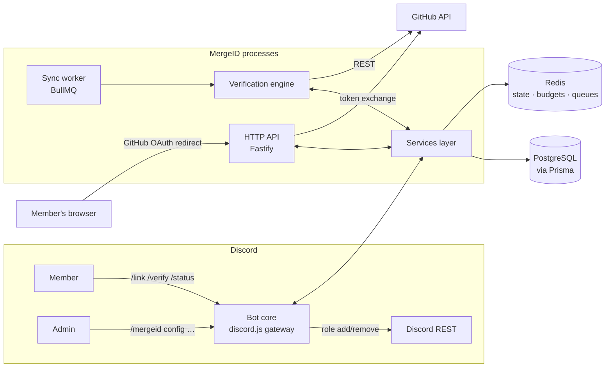

# Architecture

> Design document for MergeID — Discord ↔ GitHub account linking and verification bot.
> Status: approved design, pre-implementation. Last updated: 2026-08-05.

## 1. Goals and constraints

**Functional goals:** Discord ↔ GitHub account linking, GitHub OAuth authentication, organization
membership verification, repository collaborator/team verification, automatic role assignment,
periodic synchronization, slash commands, per-server admin configuration, secure token handling,
privacy-first architecture.

**Non-functional constraints:**

- **Multi-tenant from day one.** One bot deployment serves many Discord servers; every piece of
  configuration and state is scoped by `guild_id`. No hardcoded server IDs.
- **Privacy-first.** Store the minimum data needed, request minimal GitHub scopes, linking is
  always user-initiated, and unlinking deletes everything recoverable.
- **No privileged Discord gateway intents.** Linking runs through ephemeral slash-command
  responses; member objects are fetched on demand. No message content, no member-list intent.
- **Resilient against API limits and outages.** No role flapping during transient GitHub errors;
  no lost re-verifications during restarts.
- **Horizontally scalable later, without a redesign.** All coordination between components goes
  through PostgreSQL (durable state) and Redis (ephemeral state, queues).

## 2. System overview



## 3. Runtime components

| Component               | Responsibility                                                                      | Notes                                                                          |
| ----------------------- | ----------------------------------------------------------------------------------- | ------------------------------------------------------------------------------ |
| **Bot core**            | Discord gateway, slash-command routing, ephemeral responses, DM confirmations       | discord.js v14; intents: `Guilds` only                                         |
| **HTTP API**            | `GET /oauth/callback` (OAuth redirect target), `GET /healthz`                       | Fastify; stateless; safe to replicate behind a load balancer                   |
| **Verification engine** | Pure logic: `(link, rules, GitHub facts) → role decisions`                          | Talks to GitHub only through the GitHub adapter; unit-testable without network |
| **Sync worker**         | BullMQ consumer: periodic re-verification, retries, backoff, rate-budget accounting | Separate entrypoint; scale by adding workers                                   |
| **Services layer**      | Domain operations: links, guild config, audit events, role grants                   | The **only** layer allowed to write to the database                            |
| **Data layer**          | Prisma + PostgreSQL; Redis for ephemeral state                                      | Schema: [`database.md`](database.md)                                           |

## 4. Process topology

- **Phase 1 (MVP):** a single Node.js process runs bot + api + worker. One container, plus
  Postgres and Redis. Controlled by `MERGEID_ROLES=bot,api,worker`.
- **Phase 2 (scale):** the same codebase splits into three deployments — `bot` (one process per
  shard), `api` (N replicas behind a TLS-terminating LB), `worker` (N replicas). Nothing in the
  domain layer assumes co-location: all cross-component communication is via PostgreSQL and Redis.

## 5. Folder structure

```
src/
├── index.ts               # Entry: bootstraps runtime roles from MERGEID_ROLES
├── config/                # Env loading + zod validation (fail fast on boot)
├── discord/
│   ├── client.ts          # Gateway client, intent config, ready handling
│   ├── deploy-commands.ts # Slash-command registration (global + dev guild)
│   ├── commands/          # One module per command: link, unlink, status, verify, mergeid-admin
│   └── events/            # interactionCreate, guildCreate/leave, error handlers
├── api/
│   ├── server.ts          # Fastify instance, routes, health check
│   └── routes/oauth.ts    # GET /oauth/callback
├── github/
│   ├── client.ts          # Octokit factory (per-user token → client)
│   ├── oauth.ts           # code → token exchange, profile fetch
│   └── checks.ts          # Org / repo / team membership checks (see §8)
├── verification/
│   ├── engine.ts          # Evaluates rules for a link; emits role decisions
│   └── rules.ts           # Rule parsing/validation, required-scope derivation
├── sync/
│   ├── worker.ts          # BullMQ worker wiring, concurrency, graceful shutdown
│   └── jobs.ts            # Job definitions, repeatable schedules, retry policy
├── services/              # links.ts, guildConfig.ts, roleGrants.ts, audit.ts
├── crypto/                # AES-256-GCM token encryption, key versioning
└── lib/                   # logger.ts (pino + redaction), errors.ts, rateBudget.ts
prisma/
├── schema.prisma          # Single source of truth for the database
└── migrations/
test/                      # Mirrors src/ layout; Vitest
docker/                    # Dockerfile, docker-compose (dev + production)
docs/                      # This documentation
```

## 6. Module responsibility matrix

| Module                | Owns                                                        | Depends on              | Must never do                                |
| --------------------- | ----------------------------------------------------------- | ----------------------- | -------------------------------------------- |
| `discord/commands`    | Slash-command schemas, permission gates, ephemeral UX       | services, config        | Direct DB access, direct GitHub calls        |
| `api/routes`          | OAuth callback validation, minimal response page            | services, github/oauth  | Hold state locally, log tokens               |
| `github/checks`       | GitHub REST calls, response normalization, scope derivation | octokit, rateBudget     | Decide roles, write to DB                    |
| `verification/engine` | Pure rule evaluation, role decision diffing                 | github/checks (adapter) | Any I/O except through injected adapters     |
| `sync/worker`         | Scheduling, retries, backoff, budget acquisition            | services, verification  | Direct Discord API calls (goes via services) |
| `services/*`          | All database writes, audit events, role grant transactions  | prisma, redis           | Interpret HTTP/Discord payloads directly     |
| `crypto`              | Encrypt/decrypt GitHub tokens, key versioning               | config                  | Any network or DB access                     |

## 7. Key flows

### 7.1 Account linking

1. Member runs `/link` in a server (or DM). Bot responds **ephemerally** with a personalized
   GitHub OAuth URL.
2. Bot creates a single-use `state` nonce, stores `{state → discord_user_id}` in Redis with a
   10-minute TTL.
3. Member authorizes in the browser; GitHub redirects to `/oauth/callback?code&state`.
4. API validates + consumes `state` (Redis `GETDEL`), recovers the Discord user binding.
5. API exchanges `code` for an access token, fetches the GitHub profile (`GET /user`).
6. Guards: GitHub account not already linked to a _different_ Discord account; Discord account
   not already linked.
7. Services encrypt the token (AES-256-GCM, key-versioned) and persist the link + audit event.
8. Member's browser shows a static "you can close this tab" page; the bot DMs a confirmation and
   triggers an initial verification pass for every guild the member shares with the bot.

### 7.2 On-demand verification (`/verify`)

Member runs `/verify` → engine evaluates all rules of the current guild against the member's link
→ services reconcile roles (grant missing, revoke stale) → ephemeral result summary.

### 7.3 Periodic sync

Repeatable BullMQ jobs (one per rule, jittered) → worker loads active links in that guild →
evaluates each link via the engine → diff against stored membership results → apply only actual
changes → record results + audit. Transient GitHub errors keep the last known state (fail-open
with backoff); definitive "not a member" removes the role (fail-closed). See
[`security-model.md`](security-model.md) §role-flapping.

## 8. GitHub API surface

| Purpose                       | Endpoint                                           | Scope needed                     |
| ----------------------------- | -------------------------------------------------- | -------------------------------- |
| Token exchange                | `POST https://github.com/login/oauth/access_token` | — (client secret)                |
| Linked profile                | `GET /user`                                        | `read:user`                      |
| Org membership (state=active) | `GET /user/memberships/orgs/{org}`                 | `read:org`                       |
| Team membership               | `GET /user/teams` (client-side match org+slug)     | `read:org`                       |
| Repo access / push permission | `GET /repos/{owner}/{repo}` → `permissions.push`   | none (public) / `repo` (private) |
| Token revocation on unlink    | `DELETE /applications/{client_id}/token`           | — (client secret)                |

Design note: `/repos/{owner}/{repo}` with the _user's own_ token returns 204/404-class results
based on their actual access and includes a `permissions` object — a reliable "is this user a
collaborator with push access" check without needing an org-admin token.

## 9. Multi-server support and scalability

- **Guild scoping:** every table is keyed or indexed by `guild_id`; rule evaluation never crosses
  guild boundaries.
- **Sharding:** discord.js `ShardingManager` when guild count grows. Role operations are
  guild-local, so shards are independent; link state stays in PostgreSQL, shared by all shards.
- **Rate budgeting:** per-GitHub-token bucket in Redis (`rateBudget`); workers acquire budget
  before API calls; exponential backoff with full jitter on 403/429 and secondary-limit signals.
- **Caching:** membership results are cached per `(link, rule)` with rule-configurable TTLs, so
  unchanged users cost zero GitHub calls on re-verification.
- **Queue partitioning:** interactive jobs (user ran `/verify`) get a high-priority queue;
  background sweeps use a throttled low-priority queue. Concurrency per worker is configured, not
  hard-coded.
- **No flapping:** role changes are diff-based; transient errors never revoke; a configurable
  grace period applies before definitive removals.

## 10. Design decisions (summary)

| Decision                                      | Rationale                                                                 | Revisit when                                    |
| --------------------------------------------- | ------------------------------------------------------------------------- | ----------------------------------------------- |
| GitHub **OAuth App** (not GitHub App) for v1  | User-scoped tokens are sufficient; far simpler setup; tokens don't expire | Scale or audit needs demand GitHub App features |
| Store GitHub tokens **encrypted at rest**     | Periodic re-verification is a core feature; re-auth-per-sync is unusable  | GitHub Apps' expiring tokens offer rotation     |
| PostgreSQL + Prisma over SQLite               | Multi-instance writes, relational integrity, JSONB for guild settings     | Single-server-only deployment is ever enough    |
| Redis for state/queues over in-memory         | Required for horizontal scale; native TTL semantics for OAuth state       | Never, if scale matters                         |
| Ephemeral interactions for all sensitive UX   | OAuth URLs and link status never appear in channel history                | —                                               |
| No privileged intents                         | Smaller permission surface, no member/message data needed                 | Feature requires it (prefer alternatives)       |
| Single process → split topology via env roles | Trivial ops for small hosts; no redesign for large ones                   | —                                               |
