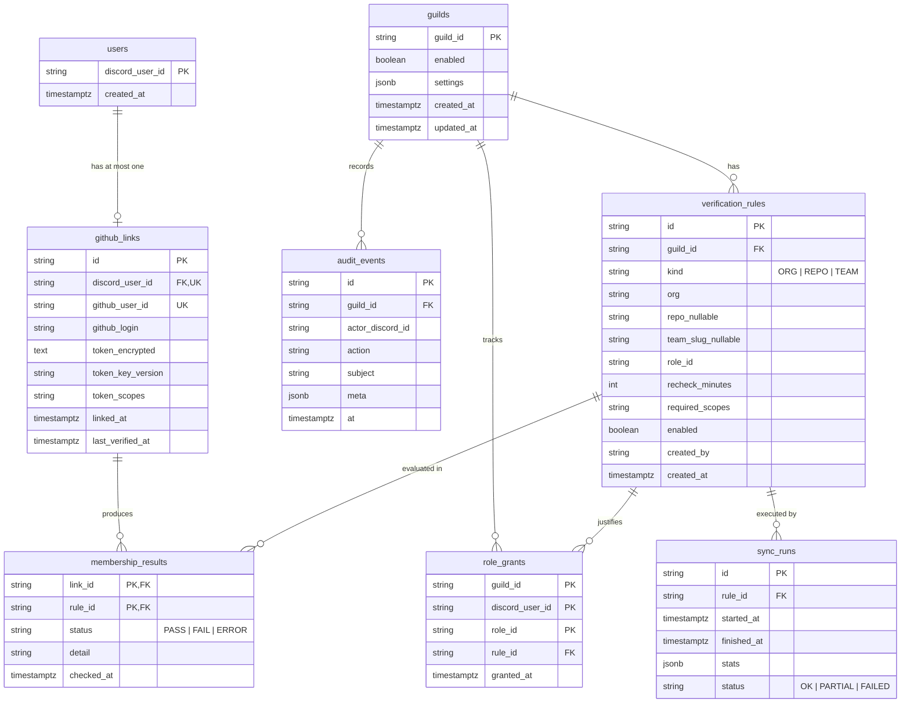

# Database schema

> PostgreSQL via Prisma. The Prisma schema file (lands in milestone M1) must match this document;
> if they ever disagree, this document wins until the schema is fixed.

## Conventions

- Discord snowflakes and GitHub numeric IDs stored as `String` (they exceed safe integer range).
- All timestamps `timestamptz`, set by the application (UTC).
- All configuration tables guild-scoped; every query path includes `guild_id` in its index.
- Sensitive values (GitHub access tokens) are encrypted at the application layer before storage
  (see [`security-model.md`](security-model.md) §5). The database never holds plaintext tokens.

## ERD

## Table definitions

### `guilds`

Per-server registration + settings. Row created when the bot joins a server (or on first admin
command).

| Column                      | Type        | Notes                                                                        |
| --------------------------- | ----------- | ---------------------------------------------------------------------------- |
| `guild_id`                  | text PK     | Discord snowflake                                                            |
| `enabled`                   | bool        | Master switch; `false` = bot ignores the guild                               |
| `settings`                  | jsonb       | `{ logChannelId?, protectedRoleIds[], gracePeriodMinutes, allowSelfServe? }` |
| `created_at` / `updated_at` | timestamptz |                                                                              |

### `users`

Discord users known to the bot (created at first `/link` attempt). Deliberately minimal — no
profile data is copied from Discord.

### `github_links`

The core of the product: one row per linked Discord user. **Unique constraints:** one link per
`discord_user_id`; one Discord account per `github_user_id` (prevents one GitHub account backing
multiple Discord identities).

| Column              | Type        | Notes                                                     |
| ------------------- | ----------- | --------------------------------------------------------- |
| `id`                | uuid PK     |                                                           |
| `discord_user_id`   | text UK     | FK → users                                                |
| `github_user_id`    | text UK     | Numeric GitHub user id (stable across renames)            |
| `github_login`      | text        | Display only; never used for authorization decisions      |
| `token_encrypted`   | text        | `v{keyVersion}:{iv}:{ciphertext}:{authTag}` (AES-256-GCM) |
| `token_key_version` | text        | Supports key rotation without re-linking                  |
| `token_scopes`      | text        | Comma-separated scopes actually granted                   |
| `linked_at`         | timestamptz |                                                           |
| `last_verified_at`  | timestamptz | Last successful verification pass (any guild)             |

### `verification_rules`

Admin-defined "GitHub fact → Discord role" mappings.

| Column            | Type    | Notes                                                                 |
| ----------------- | ------- | --------------------------------------------------------------------- |
| `id`              | uuid PK |                                                                       |
| `guild_id`        | text FK |                                                                       |
| `kind`            | enum    | `ORG`, `REPO`, `TEAM`                                                 |
| `org`             | text    | GitHub org (also the owner for `REPO` rules)                          |
| `repo`            | text?   | Set for `REPO` rules                                                  |
| `team_slug`       | text?   | Set for `TEAM` rules                                                  |
| `role_id`         | text    | Discord role granted on PASS                                          |
| `recheck_minutes` | int     | Periodic sync interval, clamped by guild settings (min 60)            |
| `required_scopes` | text    | Derived from kind + repo visibility, e.g. `read:user,read:org[,repo]` |
| `enabled`         | bool    |                                                                       |
| `created_by`      | text    | Admin Discord id (audit)                                              |

### `membership_results`

Latest evaluation of `(link, rule)`. Composite PK `(link_id, rule_id)` — one row per pair,
upserted on each check. Powers diff-based role reconciliation and the zero-call fast path.

### `role_grants`

Idempotency ledger of roles MergeID granted, and which rule justified them. On revoke, the row is
deleted. MergeID never touches roles not present here (see security model §role safety).

### `audit_events`

Append-only. Actions: `link.created`, `link.removed`, `rule.created`, `rule.updated`,
`rule.deleted`, `settings.updated`, `roles.granted`, `roles.revoked`, `sync.completed`,
`sync.failed`. `meta` carries structured detail. Retained 90 days by default (guild setting).

### `sync_runs`

Per-rule sweep statistics: checked/added/removed/error counts and terminal status. Feeds
`/mergeid sync status`.

## Indexes

- `verification_rules (guild_id, enabled)`
- `membership_results (rule_id, status)` — sweep queries
- `role_grants (guild_id, discord_user_id)` — reconcile on join/verify
- `audit_events (guild_id, at DESC)` — admin viewer
- `github_links (github_user_id)` — duplicate-link guard

## Migrations and data policy

- Schema managed by `prisma migrate` — migrations are reviewed like code.
- **Unlink deletes:** the `github_links` row (token included), all `membership_results` for that
  link, and `role_grants` for that user (after role revocation). Audit rows survive, with the
  GitHub token never included in audit `meta`.
- **Guild removal:** bot leaves guild → rules, grants, results, audit for that guild are purged.
- Backups must be treated with the same controls as the live database (they contain encrypted
  tokens; the encryption key is never stored with them).
