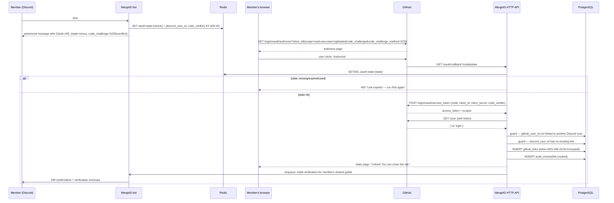

# GitHub OAuth linking flow

> End-to-end design for `/link`. Implementation lands in milestone M2.

## 0. Prerequisites (self-hosters)

1. Create a Discord application + bot; copy `DISCORD_TOKEN` and `DISCORD_CLIENT_ID`.
2. Create a **GitHub OAuth App** (not a GitHub App) at <https://github.com/settings/developers>:
   - **Authorization callback URL** = `OAUTH_REDIRECT_URI` (e.g. `https://bot.example.com/oauth/callback`).
   - Note `Client ID` / `Client secret`.
3. The MergeID HTTP role must be reachable at `PUBLIC_BASE_URL` over **HTTPS** (GitHub rejects
   insecure callbacks for production apps).

## 1. Sequence

## 2. Step details

| Step               | Detail                                                                                                                                                                                                                                                                                      |
| ------------------ | ------------------------------------------------------------------------------------------------------------------------------------------------------------------------------------------------------------------------------------------------------------------------------------------- |
| Ephemeral delivery | The OAuth URL is only ever shown in an ephemeral interaction response — it never lands in channel history.                                                                                                                                                                                  |
| `state` nonce      | 128-bit CSPRNG value. Stored in Redis as `oauth:state:{state}` → `{ discord_user_id, code_verifier }`, TTL 600 s. Single-use via `GETDEL`. This binds the browser round-trip to the exact Discord user who started it (CSRF + mix-up protection).                                           |
| PKCE               | GitHub "strongly recommends" PKCE (S256) for OAuth apps as of 2026. MergeID generates a `code_verifier` per link attempt, sends `code_challenge` in the authorize URL, and presents the verifier at token exchange — protecting the authorization code even if the redirect is intercepted. |
| Scopes             | Base scopes `read:user,read:org`. If a guild rule requires `repo` (private repo checks), the user is prompted to re-link with escalated scopes — see §5.                                                                                                                                    |
| Code exchange      | Server-side only; `client_secret` never leaves the backend. Response validated for `error` / `error_description`.                                                                                                                                                                           |
| Identity binding   | Authorization keys off GitHub's **numeric user id**, never the login (logins can change; ids cannot).                                                                                                                                                                                       |
| Duplicate guards   | GitHub account → one Discord account. Second attempt gets a clear error, not a silent overwrite.                                                                                                                                                                                            |
| Post-link trigger  | Initial verification enqueued so roles appear within seconds of linking.                                                                                                                                                                                                                    |

## 3. Failure cases

| Case                                    | Behavior                                                                           |
| --------------------------------------- | ---------------------------------------------------------------------------------- |
| State expired / already used            | 400 page: "This link expired. Run `/link` again." No partial writes.               |
| User denies authorization on GitHub     | GitHub redirects with `error=access_denied` → friendly page; nothing stored.       |
| Token exchange fails                    | 502-equivalent page + structured log; user retries via `/link`.                    |
| GitHub account already linked elsewhere | 409 page explaining one-GitHub-per-Discord policy; audit event `link.blocked`.     |
| Discord user already linked             | Callback still validates, then shows "already linked" page; no second row.         |
| Callback host unreachable / TLS broken  | `/link` keeps working; link just can't complete — surfaced in `/healthz` and logs. |

## 4. Token lifecycle

1. **Issue** — token stored immediately encrypted (AES-256-GCM, key-versioned); plaintext exists
   only in process memory during the callback request.
2. **Use** — verification engine requests a decrypted token from services; decryption happens at
   call time, never cached to disk.
3. **Escalate** — when a new rule needs a scope the stored token lacks, affected users are nudged
   to re-link (`/status` shows missing scopes).
4. **Expire/invalid** — GitHub OAuth App tokens don't expire by default, but if any call returns
   401 the link is flagged `needs_relink` and roles are paused (not revoked) until re-link.
5. **Revoke** — `/unlink` calls `DELETE /applications/{client_id}/token` (revokes on GitHub's
   side too), then deletes the row. Leaving a server does _not_ unlink — the account link is
   global to the user; per-guild state is what gets cleaned up.

## 5. Scope policy

| Rule kind        | Check performed                                   | Scopes needed             |
| ---------------- | ------------------------------------------------- | ------------------------- |
| `ORG`            | `GET /user/memberships/orgs/{org}` state = active | `read:user,read:org`      |
| `TEAM`           | `GET /user/teams` match org + slug                | `read:user,read:org`      |
| `REPO` (public)  | `GET /repos/{owner}/{repo}` → `permissions.push`  | `read:user,read:org`      |
| `REPO` (private) | same endpoint, but repo invisible without access  | `read:user,read:org,repo` |

MergeID never requests `write` scopes: verification is read-only by design, and the bot should
never be able to act _as_ the user.
